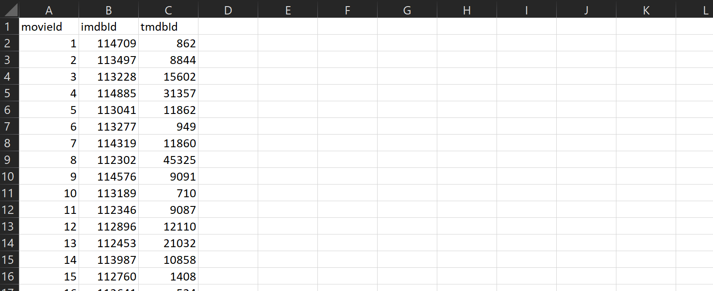
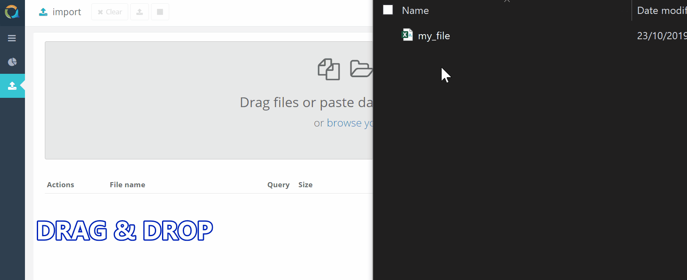

QuestDB is relational and time series database. It is wire compatible with PostgresSQL and InfluxDB;  
accessible via SQL over network and embedded; accessible programmatically from Java for ultimate performance.

## Installation
There is a variety of installation methods and access methods for your convenience.

### Installation using Docker image

Docker is a convenient method to have QuestDB running very quickly via simple command. You will of course need Docker
to be installed on your system. QuestDB has images for Windows, Linux and ARM64 Linux as well as manifest to automatically
download correct image for your target architecture.

To install and use Docker, please refer to our **[Docker instructions](docker.md)**.

Disadvantage of Docker is that QuestDB will be running in a virtualized environment with up to 20% performance penalty.

### Manual installation

QuestDB can be installed manually via downloading ZIP archive, extracting and running binary. Target system will require Java 8
to be present and QuestDB will have to know directory where Java is installed. To install manually, please refer to
our **[Binaries guide](binaries.md)**

### Via Maven dependency

To use QuestDB as embedded database with your JVM based language simply add the following dependency:

```
    implementation 'org.questdb:core:4.0.1'
```

or

```xml
    <dependency>
        <groupId>org.questdb</groupId>
        <artifactId>core</artifactId>
        <version>4.0.1</version>
    </dependency>
```

## Input methods

### Import via REST
You can import a file using `curl` as follows to import .csv or .txt files.
```shell script
curl -i -F data=@ratings.csv http://localhost:9000/imp
```

By default, QuestDB will analyse the data and determine if headers are present. It will also decide on the 
appropriate schema. Users that want more control can use an array of options to flag if the data as headers, to pass a custom schema,
to decide on durability and atomicity settings. 

> For more information on this and the REST API, see our **[rest API guide](rest.md)**.

### Import via Web Console
You can get `.txt` or `.csv` files into QuestDB using the web console. There are several methods.

#### Copy & Paste the data from the clipboard:



#### Drag & Drop the file:



#### Use the SQL `copy` command:


> For more information on how to use the console, see our **[web console guide](console.md)**.

### Import programmatically via Java

The following uses `tablewriter` to write into a table programatically in java.

```java
AllowAllSecurityContextFactory securityContextFactor = new AllowAllSecurityContextFactory();
CairoSecurityContext cairoSecurityContext = securityContextFactor.getInstance("admin");
try (TableWriter writer = engine.getWriter(cairoSecurityContext, "abc")) {
    for (int i = 0; i < 10; i++) {
        TableWriter.Row row = writer.newRow(Os.currentTimeMicros());
        row.putInt(0, 123);
        row.putByte(1, (byte) 1111);
        row.putShort(2, (short) 222);
        row.putLong(3, 333);
        row.putFloat(4, 4.44f);
        row.putDouble(5, 5.55);
        row.putDate(6, System.currentTimeMillis());
        // skip 7 - see separate function to write blobs
        // skip 8 - timestamp is already set via newRow() call
        row.putSym(9, "xyz");
        row.putStr(10, "abc");
        row.putBool(11, true);
        row.append();
    }
    writer.commit();
}
```

### INSERT via JAVA

The following uses the `SqlCompiler` to compile and execute SQL queries. In this case, we use it
to run an `INSERT` statement. The `SqlCompiler` can also be used to run any other SQL statement.

```java
CairoConfiguration configuration = new DefaultCairoConfiguration("/tmp/my_database");
BindVariableService bindVariableService = new BindVariableService();
try (CairoEngine engine = new CairoEngine(configuration)) {
    try (SqlCompiler compiler = new SqlCompiler(engine, configuration)) {
        compiler.compile(
            "insert into balances (cust_id, balance_ccy, balance, timestamp);"
        );
    }
}
```

## Output methods

### SQL via WebConsole
Run `SQL` and see the results directly in the web console. You can also export results to .csv.


### SQL via rest
The following will use `curl` to send a query over http. The result will be sent back over HTTP.
Note that the `query` is url-encoded.

```shell script
C:\Users\info>curl -v -G http://localhost:9000/exp --data-urlencode "query=select * from mydb;" -d limit=5
*   Trying ::1...
* TCP_NODELAY set
*   Trying 127.0.0.1...
* TCP_NODELAY set
* Connected to localhost (127.0.0.1) port 9000 (#0)
> GET /exp?query=select%20%2A%20from%20mydb%3B&limit=5 HTTP/1.1
> Host: localhost:9000
> User-Agent: curl/7.55.1
> Accept: */*
>
< HTTP/1.1 200 OK
< Server: questDB/1.0
< Date: Mon, 25 Nov 2019 12:33:01 GMT
< Transfer-Encoding: chunked
< Content-Type: text/csv; charset=utf-8
< Content-Disposition: attachment; filename="questdb-query-1574685181623.csv"
< Keep-Alive: timeout=5, max=10000
<
"userId","movieId","rating","timestamp"
1,307,3.5000000000,1256677221
1,481,3.5000000000,1256677456
1,1091,1.5000000000,1256677471
1,1257,4.5000000000,1256677460
1,1449,4.5000000000,1256677264
* Connection #0 to host localhost left intact
```

### SQL via Java
The following will use `SqlCompiler` to compile and run any query. Note that we also used `SqlCompiler`
to write data through `INSERT` queries.

```java
CairoConfiguration configuration = new DefaultCairoConfiguration("/tmp/my_database");
BindVariableService bindVariableService = new BindVariableService();
try (CairoEngine engine = new CairoEngine(configuration)) {
    try (SqlCompiler compiler = new SqlCompiler(engine, configuration)) {
        compiler.compile(
            "SELECT avg(temperature) FROM sensors_readings" +
             "WHERE isOn = 1;"
        );
    }
}
```
