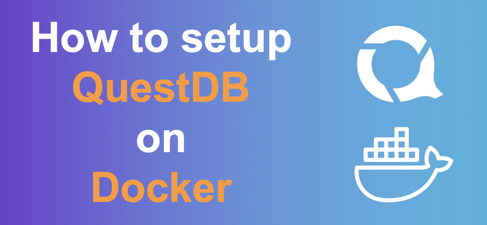

Docker is great to try new stuff and get started in minutes with just a few commands. Follow this guide to set up and start using QuestDB from scratch. By the end, you will be able to set up containers, send data and run queries using the REST API and the web console.

## Install Docker
Before we start, you will need to install Docker. You can find guides for your platform here. The linux page points to several guides depending on your distribution (Fedora, Debian, Ubuntu, etc). For Unix machines, this requires sudo rights.

## Pull the QuestDB image
Now that you have installed Docker, you need to pull the QuestDB image. The below command will pull the latest image from our repository, which is updated with every release.

```sql
docker pull questdb/questdb
```

## Create a container
In this guide, we show how to use the REST API and the web console. Both use port 9000 by default. You can also map other ports if you plan to use the Postgres adapter or to send data using Influx Line Protocol for example. You can also mount volumes. Find more information on the [Docker configuration page](installFromDockerImage.md).

The below will use the image you just pulled to create a container called **questdb** with local port 9000 mapped to the container. This will open up the HTTP API.

```sql
docker create --name questdb -p 9000:9000 questdb/questdb
```

>If you 
 would like to enable the Postgres wire instead, you will need to open port `8812`. Find out more about possible Docker
  configurations [here](installFromDockerImage.md).

## Start the container
Now that you have created a container.

```sql
docker start questdb
```

Here is what it looks like to start QuestDB on docker in just 3 commands


You can check the status of your container with **docker ps**. It also lists the ports we have mapped.

```sql
docker ps
```

```shell script
CONTAINER ID        IMAGE               COMMAND                  CREATED             STATUS              PORTS                              NAMES
2cc042a64a73        questdb/questdb     "/app/jre/bin/java -…"   14 seconds ago      Up 3 seconds        8892/tcp, 0.0.0.0:9000->9000/tcp   questdb
```

## Create tables
With your container running and port 9000 mapped, you can now send curl requests to the database server. You can also access the web console by navigating to [http://localhost:9000](http://localhost:9000).

The first step is to get data into the database. Here are some sample files you may want to try. You may use only one (we provide example queries for both), but using the two files will allow you to try asof join.
NYC taxi data 
NYC weather 
@TODO - download links


First, we create the tables using SQL. We also specify a designated timestamp column which will be useful for time-based queries and time joins across tables.
```sql
curl -G http://localhost:9000/exec --data-urlencode \
"query=CREATE TABLE trips(pickupDatetime timestamp, \
dropoffDatetime timestamp, passengerCount int, tripDistance double, \
fareAmount double, tipAmount double, taxesAndTolls double, totalAmount double) \
timestamp(pickupDatetime);"
```
```sql
curl -G http://localhost:9000/exec --data-urlencode \
"query=CREATE TABLE weather(timestamp timestamp, windSpeed int, \
skyCover symbol, tempF int, rain1H double, snowDepth int) \
timestamp(timestamp);"
```

Note that the table creation step is optional as QuestDB automatically recognizes schema. However, creating the table manually allows us to specify a `dedicated timestamp` column which will be useful for time-based queries, and to specify `symbol` which are more efficient than the automatically `string` type for skyCover. 

## Import data

We import both files using the `/imp` endpoint. Note that I set the flag `name` so the data flows into the tables we just created. Otherwise the data would be inserted in a new table named after the file, for example `weather.csv`. We also set the `timestamp` flag to mark the designated timestamp column in the csv file.

```sql
curl -i -F data=@trips.csv \
"http://localhost:9000/imp?\
name=trips&forceHeaders=true&overwrite=false&timestamp=pickupDatetime"
```

```sql
curl -i -F data=@weather.csv \
"http://localhost:9000/imp?\
name=weather&forceHeaders=true&overwrite=false&timestamp=timestamp"
```

In addition to the csv import, we can also use the REST API to execute SQL to insert values. Here is an example.
You can define the schema with your insert request. This is useful to send values in a different order from the table definition. It is also useful to skip values when they are not relevant. Missing values will be inserted as null.

```sql
curl -G http://localhost:9000/exec --data-urlencode \
"query=INSERT INTO weather(timestamp,tempF) values(systimestamp(),45);" 
```

## Run queries
Now that we have tables with data, we can run queries. The easiest way is to use the web console, which allows you to edit SQL and to visualise your results.


Alternatively, you can use the HTTP API to send queries and get results in JSON.
```sql
curl -G http://localhost:9000/exec --data-urlencode \
"query=select timestamp, tempF from weather limit 2;"  
```

JSON Response
```json
{
   "query":"select timestamp, tempF from weather limit 2;",
   "columns":[
      {
         "name":"timestamp",
         "type":"TIMESTAMP"
      },
      {
         "name":"tempF",
         "type":"INT"
      }
   ],
   "dataset":[
      [
         "2010-01-01T00:00:00.000000Z",
         34
      ],
      [
         "2010-01-01T00:51:00.000000Z",
         34
      ]
   ],
   "count":2
}
```          

Here are a few example queries you could run either in the web console or using `curl`.

| table | description | query |
|---|---|---|
|trips|Average week by week trip distance over time |`select pickupDatetime, avg(tripDistance) from trips timestamp(pickupDatetime) sample by 7d;` |
|trips|Average monthly trip duration in minutes |`select pickupDatetime, avg(datediff('m',pickupDatetime, dropoffDatetime)) from trips sample by 1M;` |
|trips|Average fare per passenger count bucket |`select passengerCount, avg(tipAmount/fareAmount)*100 from trips order by passengerCount;` |
|trips|Average tip percentage per passenger count bucket |`select passengerCount, avg(tipAmount/fareAmount)*100 from trips order by passengerCount;` |
|weather|Rainy days |`select timestamp, sum(rain1H)from weathersample by 1d; `|
|weather|Temperature seasonality |`select timestamp, avg(tempF)from weather sample by 7d;` |
|trips and weather|Joining trips and weather data. This query returns the prevailing weather conditions for every trip in 2017 |`trips where pickupDatetime='2017' asof join weather;` |

## Download results
You can use the `/exp` endpoint to export query results as follows.
```sql
curl -G http://localhost:9000/exp --data-urlencode \
"query=select * from weather limit 100;" > results.csv       
```
If you are querying from the web console, then you can download the results using the `download to csv` button.


## Shut down and cleanup
As QuestDB is a persisted database, the data will remain after you shut down the container. If you would like to remove the data, you can run the following to drop the tables.
```sql
DROP TABLE trips;
DROP TABLE weather;
```

You can then shut down and remove the container.
```sql
docker stop questdb  
docker rm questdb
```

## Conclusion
This was just an overview of what you can do with the REST API. 
We will follow up with more guides on other ways to use QuestDB such as the postgres adapter. 
If you have any questions or would like us to implement features, feel free to [join our community Slack](https://serieux-saucisson-79115.herokuapp.com/) or to [raise an issue on Github](https://github.com/questdb/questdb).
