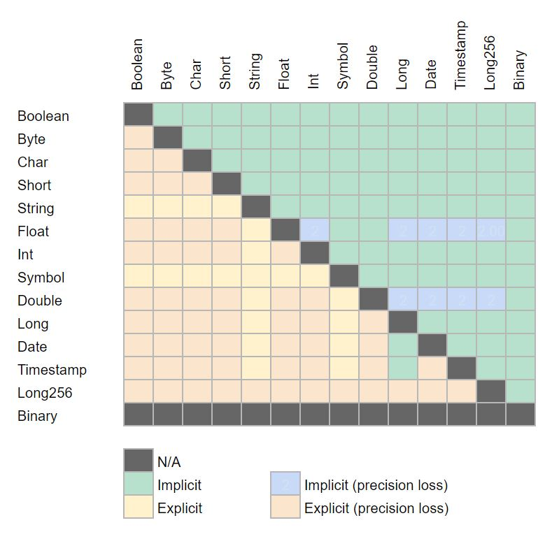

QuestDB implements type conversion explicitly via `cast()` and implicitly when required by the context.

## Explicit conversion

Types can be converted from one to another using the `cast()` function. This function is documented **[here](refFUNC.md#cast)**.


> Explicit casting of an expression to a smaller **[data type](refDATATYPES.md)** may result in loss of data
> when the output data type is smaller than the expression. 

- Casting a decimal number type (`float` or `double`) to an integer number type (`long`, `int`, `short`) 
will result in decimals drop. 
- If the integer part being cast is larger than the resulting data type, it will be resized by truncating bits.
- Conversions from `char` to a number type will return the corresponding `unicode` number and vice versa.

Examples:
```sql
-- Query
SELECT cast(3.5 + 2 as int), cast  FROM long_sequence(1);
SELECT cast(773456789945699L as int) FROM long_sequence(1);
SELECT cast(2334444.323 as short) FROM long_sequence(1);

-- Result
| cast                        |
|-----------------------------|
| 5                           | -- Loss of the decimals
| 1899412835                  | -- Long truncated to int by truncating bits resulting in another number  
| -24852                      | -- Loss of decimals and integer part bits are truncated resulting in another number
```


## Implicit conversion

When an operation requires a specific data type, QuestDB
will attempt to convert to the data type required by the context. This is called `implicit conversion` 
and does not require explicit conversion using the `cast()` function.

The below chart illustrates the explicit and implicit cast available in QuestDB.



> Implicit casting prevents data loss. When an operation involves multiple types, the resulting type will be the smallest possible
type so that no data is lost. 

Examples:
```sql
-- Query
SELECT 1234L + 567 FROM long_sequence(1);
SELECT 1234L + 0.567 FROM long_sequence(1);
SELECT to_timestamp('2019-10-17T00:00:00', 'yyyy-MM-ddTHH:mm:ss') + 323 FROM long_sequence(1);
SELECT to_timestamp('2019-10-17T00:00:00', 'yyyy-MM-ddTHH:mm:ss') + 0.323 FROM long_sequence(1);

-- Result
| 1801                           | -- Returns a long.
| 1234.567                       | -- Implicit cast to double.
| 2019-10-17T00:00:00.000323Z    | -- Returns a timestamp with an extra 323 microseconds.
| 1571270400000000               | -- Implicit cast to double as timestamp are long integers.
```

> When inserting into a table, QuestDB will cast data implicitly to match the type of the destination column.

Examples:
```sql
-- Query
CREATE TABLE my_table(my_number long);

-- The below statement will perform an implicit cast of the timestamp to long.
INSERT INTO my_table values((to_timestamp('2019-10-17T00:00:00', 'yyyy-MM-ddTHH:mm:ss'));
-- Result
| 1571270400000000   | -- Returns a long.

-- It is equivalent to this statement
INSERT INTO my_table values
            (cast(to_timestamp('2019-10-17T00:00:00', 'yyyy-MM-ddTHH:mm:ss') as long));
-- Result
| 1571270400000000   |
```