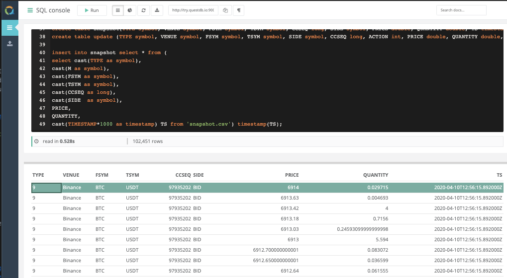
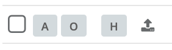
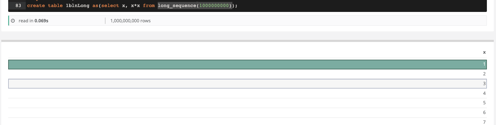
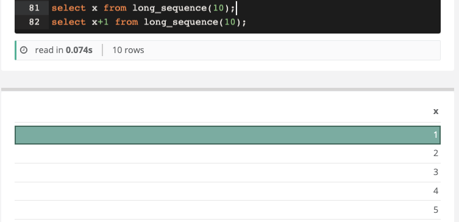
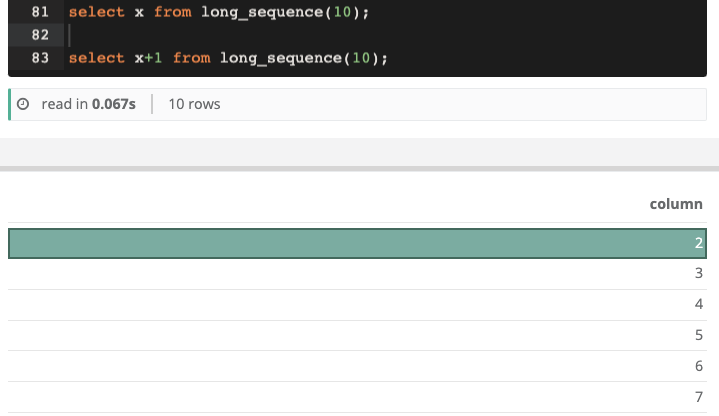

QuestDB offers a Web Console to visually interact with your data.
It allows you to import data in to the database, run queries on the fly, visualise and export results.
It uses the HTTP API in the background but lets you interact with QuestDB in an intuitive way.



After starting QuestDB, you can access the console here: [http://localhost:9000/index.html](http://localhost:9000/index.html)

> If QuestDB is running on another machine of your network, the web console can be accessed on `http://IP_OF_THE_MACHINE:9000`

Available screens are:
- [Import screen](#import-screen) - to import data and define schemas
- [SQL screen](#sql-screen) - to run SQL commands and view results

You can navigate between the two screens using the navigation bar on the left-hand side of the web console.


## Import screen


The import screen can be accessed by clicking this icon on the left-side navigation menu. 

 

The import screen lets you:
- [Load data](#loading-data) using either [drag & drop](#drag--drop-method), [copy & paste](#copy--paste-method), or simply [browse a file](#browse-files-method).
- [Check the import results](#checking-the-import).
- [Customise the import](#custom-import).
- [Amend the schema](#amending-the-schema).


### Loading data

The Import screen allows you to instantly load data. QuestDB will automatically recognise the schema by analysing a sample of the data.

> You can [amend the schema after the fact](#amending-the-schema), but this will require a [re-import](#custom-import).
If you would like to define the schema before ingesting (for example if you are importing a large file), we recommend you use the [HTTP API](restAPI.md).

Available methods in the Import screen are:
- [drag & drop](#drag--drop-method)
- [copy & paste](#copy--paste-method)
- [browse a file](#browse-files-method)


#### Drag & drop method

Simply drag and drop the data file you wish to import in the drag & drop area:


#### Copy & paste method

You can also `COPY & PASTE` from your clipboard into this area. Select the data you would like to import
(from Excel, csv, text etc) and it will import automatically upon pasting into this area.

You can copy data from clipboard from csv, excel and text files.


#### Browse files method

Click the **browse your files** button, and select the file you wish to import.

### Checking the import
Once a file starts importing, a new line will appear in the Import screen. You can check the details and status of the import and the result directly in this screen.


#### Import details
| Column | Description |
|--------|--------------|
|File name| Name of the file imported. If imported from copy & paste, an automatically-generated file name|
|Size| Size of the imported file|
|Total rows| Number of rows successfully imported|
|Failed rows| Number of rows that failed to import|
|Header row| Whether the dataset has been recognised to have a header row or not|
|Status| Status of the import. See below|


#### Import statuses
| Status | Description |
|----|----|
| importing | data is being imported |
| failed    | import failed, nothing was imported|
| imported in [time] | import is finished. The completion time will be displayed next to the status|
| exists | you are trying to import a file that already exists. To import it anyways, you can either **append** or **override**. See [importing again](#custom-import) for a more exhaustive description| 


#### Exploring your data
Once your file is imported, you can start exploring it immediately using the following button. It will 
take you to the [SQL screen](#sql-screen) and load the target table.


### Amending the schema
Although the schema is automatically detected, you can amend the type for any column using the following steps:
- Click on the file you want to amend in the Import screen. The schema will be displayed.
- Find and click on the column which type you want to change.
- You will then need to [re-trigger the import](#custom-import).
 

### Custom import
You can amend the import behaviour with the following options. This will trigger to import the data again.




|Option | Name | Description |
|----|----|----|
| A | Append | Uploaded data will be appended at the end of the table|
| O | Override | Uploaded data will override existing data in the table |
| LEV | Skip lines with extra values | Skips rows that contains dangling values that don't fit the schema |
| H | Header row | Flag whether the first row should be considered header |


**To start the import, click the following button:**

 


## SQL screen

The SQL screen allows you to run queries on your database directly from your web browser. 
You can access it via this button situated on the left-hand navigation bar: 
 


### Layout

The upper half is the SQL entry window. This is where you type SQL commands.
The bottom half is the results area, where your query results will be displayed. 
You can toggle between 
- the results pane to display the results as a table 
- the visualisation pane to display the results as charts


### Controls

Here is an overview of the available controls.


### Running SQL commands
Simply type your query in the editor. Then click the following button:


The results will be displayed in the table below the SQL editor. 
You will also see metrics such as `execution time` and `number of records`. 
You can also use [keyboard shortcuts](#keyboard-shortcuts).


#### Keyboard shortcuts
You can use the following keyboard shortcuts:
| Shortcut | Action |
|---|---|
| Run Query | `F9` or `CTRL` + `Enter` or `CMD` + `Enter` (MacOS) |
| Locate cursor | `F2`. Use this to focus the SQL editor on your cursor in order to locate it|

Example:


#### Behaviour

As you can write numerous SQL commands separated by semicolon, the web console uses the following logic to decide 
what command to execute.

- If you have highlighted a command or part of it, this will be executed.
- If your cursor is within a SQL statement, this statement will be executed.
- If your cursor is on the same line as an SQL statement and after the semicolon, this statement will be executed.
- If your cursor is on a line that contains no SQL statement, the next encountered statement will be executed. If there is no statement following the cursor, 
then the previous statement will be executed.

**Examples:**

- Command highlighted. Note neither the `CREATE TABLE` statement nor the `x*x` column have been executed and evaluated.



- Cursor within a SQL statement


- Cursor outside of a statement but on the same line


- Cursor on another line


### Visualisation pane
The visualisation pane lets you plot charts to visualise the results of a query. 

#### Toggling between panes
You can toggle between the visualisation pane and 
the results table pane using the following buttons.


#### Plotting a visualisation 
Follow these steps to plot a visualisation:
- Run a SQL query with the results you would like to plot
- Toggle the visualisation pane
- Choose the chart type (currently available are area, bars and line)
- Choose which field should be the `x-axis` category `label`.
- Choose one or more fields to be plotted as `Series`.
- Click the `Draw` button.

> Note: one of the output columns of your query should be the x-axis label.

#### Example
Let's use a `weather` dataset to display the average monthly temperature over time.
We run the following SQL 
```sql
select TS, avg(tempF) from weather sample by 1M;
```

We then setup the chart as follows and click the `Draw` button


### Exporting Results
Once you have received results form a query, you can download them in a `.csv` file through your browser 
by clicking the download button at the top of the console.


>If you are running QuestDB from a remote machine, the download time will be significantly higher due to the network 
>transfer between the server and your local machine.

## Tips

### Loading Data faster with SQL
If the file you wish to import is on the same machine as the QuestDB server, you can use the `COPY` command directly in the web console to import from a file.
This method is significantly faster as it bypasses the HTTP layer and lets QuestDB access the file directly on the local machine.

> This method is only available if the following two conditions are met:
>- The file resides on the same machine as the database server
>- The file is located within the database root folder

Syntax is `COPY tablename FROM file_path`.

Example:
```sql
COPY prices FROM `c:\\user\desktop\prices.csv`;
```


### Extracting the url-encoded query endpoint
After running a SQL command, the url-encoded endpoint is displayed at the top of the Query screen. You can copy it and use it to:
- share query results with another user: they can download the results by themselves.
- help design requests to send using the [HTTP api](restAPI.md).


### Search the docs
There is a search box in the top-right corner to help you find information on features and available commands. Simply type 
the keywords you are looking for in the window and select the category you are interested in.


### Rename your tables with SQL
By default, QuestDB imports files with the full file name (e.g `my_file_name.csv`) or generating a name based on date & time for 
clipboard import (e.g `clipboard-1586805423709`. You can use [RENAME TABLE](sqlRENAME.md) to rename it to your liking.
```sql
RENAME TABLE 'clipboard-1586805423709' TO 'my_table';
```