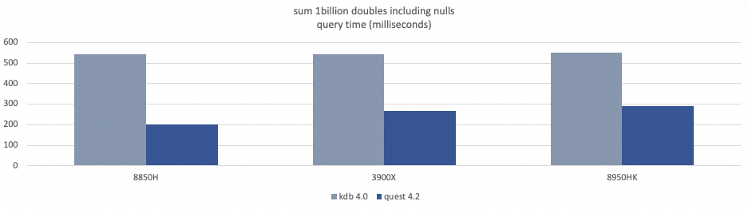

Today we release QuestDB 4.2, which brings a set of dramatic performance improvements. The main event is 
the introduction of SIMD-based aggregations, which result in ~100x performance improvements.

If you like what we are doing, please consider <b> <a href="https://github.com/questdb/questdb"> visiting our github repository and leaving a star </a></b>
          

### Introducing SIMD instructions
<a href="https://en.wikipedia.org/wiki/SIMD" target="_blank">SIMD instructions</a> are specific CPU instruction sets for arithmetic calculations that use synthetic parallelisation. 
The parallelisation is said synthetic because instead of spreading the work across CPU cores, 
SIMD performs vector operations on multiple items using a **single** CPU instruction. 
In practice, if you needed to add 8 numbers together, SIMD does that in 1 operation instead of 8.
We get compounded performance improvements by combining SIMD with actual parallelisation and spanning the aggregation calculation across CPUs.

As of now, this new feature is available for aggregation queries such as
```select sum(value) from table```. In further releases, we will extend these to keyed aggregations, for example
```select key, sum(value) from table``` (note the intentional omission of `GROUP BY`). This will also result in ultrafast 
aggregation for time-bucketed queries using `SAMPLE BY`.

### How do we fare versus kdb+?
To get an idea of how fast the new version is, we ran a benchmark against kdb+, which has been known as the fastest
 time-series database for the past 20 years. Coincidentally, their new version 4.0. (released a few days ago)
introduces performance improvements through further parallelism. We benchmarked QuestDB against this latest version. 

For non-null doubles, questDB sums 1 billion values in roughly the same time as kdb (ok, slightly slower):


As we include null numbers in the dataset, kdb's performance deteriorates significantly: it takes twice as much time to complete the same query. 
On the other hand, QuestDB's performance does not degrade once introducing null values:



With max on non-null longs, QuestDB also outperforms kdb+ by about 2x:


### Takeaways for the community:
- These new techniques improved our aggregation performance by a factor of ~100x. 
- Alongside our previous optimization and innovation breakthroughs, SIMD instructions result in a new level of performance;  we are 2x faster than kdb+ for most aggregation queries.
- 100% of our code is **[open-source](https://github.com/questdb/questdb)**!


### About the release

#### Summary
We have implemented SIMD-based vector execution of queries, such as `select sum(value) from table`.
This is around 100x faster than non-vector based execution. This is just the beginning. We are bringing vectors to more operations.
Try our first implementation in this release and stay tuned for more features in the upcoming releases!

#### Important
Metadata file format has been changed to include a new flag for columns of type symbol. 
It is necessary to convert existing tables to new format. Running the following sql: `repair table myTable` will update the table metadata.

#### What is new?
- Java: vectorized sum(), avg(), min(), max() for DOUBLE, LONG, INT
- Java: select distinct symbol optimisation
- FreeBSD support
- Automatically restore data consistency and recover from partial data loss.

#### What we fixed
- SQL: NPE when parsing SQL text with malformed table name expression , for example ')', or ', blah'
- SQL: parsing 'fill' clause in sub-query context was causing unexpected syntax error (#115)
- SQL: possible internal error when ordering result of group-by or sample-by
- Data Import: Ignore byte order marks (BOM) in table names created from an imported CSV (#114)
- SQL: 'timestamp' propagation thru group-by code had issues. sum() was tripping over null values. Added last() aggregate function. (#113)
- LOG: make service log names consistent on windows (#106)
- SQL: deal with the following syntax 'select * from select ( select a from ....)'
- SQL: allow the following syntax 'case cast(x as int) when 1 then ...'
- fix(griffin): syntax check for "case"-')' overlap, e.g. "a + (case when .. ) end"
