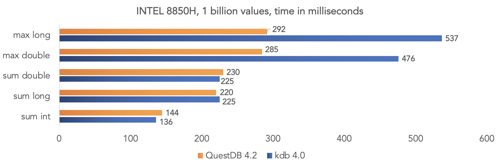
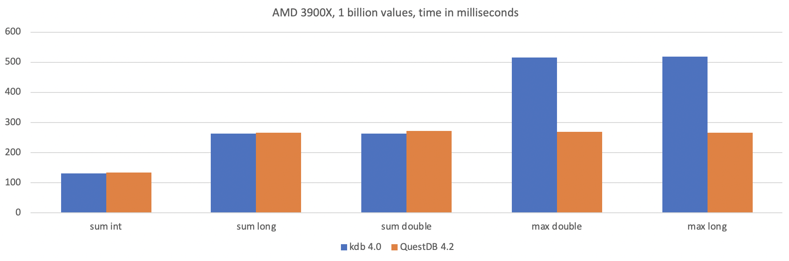
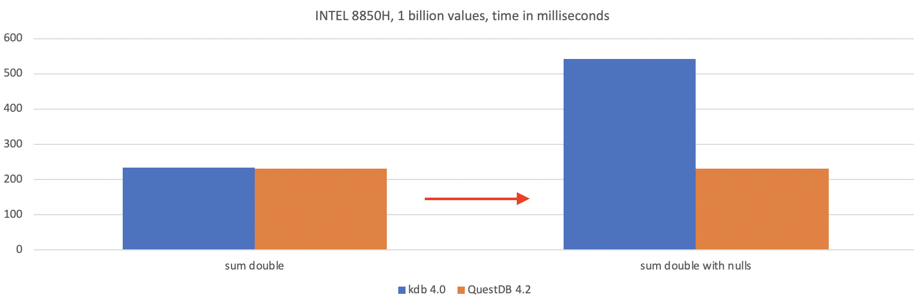
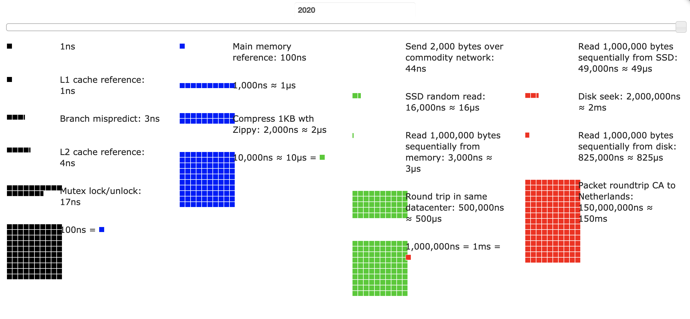
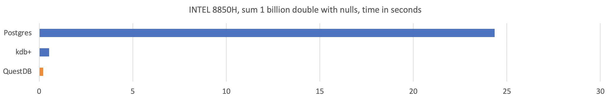

 

<a href="https://en.wikipedia.org/wiki/SIMD" target="_blank">SIMD instructions</a> are specific CPU instruction sets for arithmetic calculations that use synthetic parallelisation. 
The parallelisation is synthetic because instead of spreading the work across CPU cores, 
SIMD performs vector operations on multiple items using a **single** CPU instruction. 
In practice, if you were to to add 8 numbers together, SIMD does that in 1 operation instead of 8.
We get compounded performance improvements by combining SIMD with actual parallelisation and spanning the work across CPUs.


QuestDB 4.2 introduces SIMD instructions, which made our aggregations faster by 100x! 
It is available [open-source under Apache 2.0](https://github.com/questdb/questdb).
 
 As of now, SIMD operations are available for queries such as
```select sum(value) from table```. In further releases, we will extend these to keyed aggregations, for example
```select key, sum(value) from table``` (note the intentional omission of `GROUP BY`). This will also result in ultrafast 
aggregation for time-bucketed queries using `SAMPLE BY`.

If you like what we do, please consider <b> <a href="https://github.com/questdb/questdb"> following us on Github and starring our project </a></b>


### How fast is it?
To get an idea of how fast aggregations have become, we ran a benchmark against kdb+, which has been marketing itself as the fastest time-series database for the past 20 years. Coincidentally, their new version 4.0 (released a few days ago)
introduces performance improvements through further parallelism. 

#### Setup
We have benchmarked QuestDB against kdb's latest version using 2 different CPUs: the [Intel 8850H](https://ark.intel.com/content/www/us/en/ark/products/134899/intel-core-i7-8850h-processor-9m-cache-up-to-4-30-ghz.html) 
and the [AMD Ryzen 3900X](https://www.amd.com/en/products/cpu/amd-ryzen-9-3900x). Both databases were running on 4 threads.

#### Queries
|Test	|Query (kdb+ 4.0)	|Query (QuestDB 4.2)|
|---|---|---|
|sum of 1G doubles <br/> no nulls	|zz:1000000000?1000.0 <br/>\t sum zz	|create table 1G_double_nonNull as (select rnd_double() d from long_sequence(1000000000)); <br/> select sum(d) from 1G_double_nonNull;|
|sum of 1G ints <br/> no nulls |zz:1000000000?1000i <br/> \t sum zz         |create table 1G_int_nonNull as (select rnd_int() i from long_sequence(1000000000)); <br/> select sum(i) from 1G_int_nonNull; |
|sum of 1G longs <br/> no nulls	|zz:1000000000?1000j <br/>\t sum zz|	create table 1G_long_nonNull as (select rnd_long() l from long_sequence(1000000000));<br/>select sum(l) from 1G_long_nonNull;|
|max of 1G doubles <br/> no nulls	|zz:1000000000?1000.0<br/>\t max zz|	create table 1G_double_nonNull as (select rnd_double() d from long_sequence(1000000000));<br/>select max(d) from 1G_double_nonNull;|
|max of 1G longs <br/>no nulls	|zz:1000000000?1000<br/>\t max zz|	create table 1G_long_nonNull as (select rnd_long() l from long_sequence(1000000000));<br/>select max(l) from 1G_long_nonNull;|

#### Results



For these simple aggregation queries, QuestDB is up to 2x faster than kdb+ on the same hardware. This gap widens once we 
introduce complexities. As we introduce some `null` values in the data, the performance of kdb+ suddenly drops significantly. 
On the other hand, QuestDB's performance figures are the same with or without nulls.

|Test	|Query (kdb+ 4.0)	|Query (QuestDB 4.2)|
|---|---|---|
|sum of 1G doubles <br/>(nulls)	|zz:1000000000?1000.0 <br/>zz:?[zz<100;0Nf;zz]<br/>\t sum zz|	create table 1G_double as (select rnd_double(5) d from long_sequence(1000000000));<br/>select sum(d) from 1G_double;|
|max of 1G doubles <br/>(nulls)	|zz:1000000000?1000.0<br/>zz:?[zz<100;0Nf;zz]<br/>\t max zz|	create table 1G_double as (select rnd_double(5) d from long_sequence(1000000000));<br/>select max(d) from 1G_double;|




### Perspectives on performance
The execution times outlined above become more interesting once put into context.
On the 8850H, QuestDB sums 1 billion integers in 144 milliseconds which roughly translates to `1bln / 0.142 =  7,042,253,521` 
records per second. Let us round that down to `7 billion records a second`. We can derive the time to sum two records 
as `2 / 7bln = 0.000000000285714285714 secs`. That is `0.28 nanoseconds`!
  
Here are the **[latency numbers every programmer should know](https://colin-scott.github.io/personal_website/research/interactive_latency.html)** for 2020.
A L1 cache reference is 1 nanosecond. Over one billion integers, QuestDB adds 2 together in 0.28 nanoseconds. **QuestDB can sum 6 integers together
before a CPU can finish one L1 cache reference!**



We found that the limiting factor at this stage is on the memory side. In QuestDB, an `int` is `4 bytes`. In terms of storage, 
1 billion integers takes `1,000,000,000 x 4 / 1024 / 1024 / 1024 = 3.75 GB` of data. The 8850H has 2 memory channels and 
a maximum memory bandwidth of 42.7GB / second. Our sum aggregation query takes 0.142 seconds for 3.75 GB of data, which translates into 
` 3.75 / 0.142 = 26.4 GB/second`.

Another perspective is to compare these performance figures with other popular databases. 
Here is how QuestDB compares to Postgres to sum 1 billion numbers from a given table `select sum(d) from 1G_double_nonNull;`. 
This was a simple algorithm: sum values. The performance gap widens significantly with more complex queries.




### What is next?
In further releases, we will roll out this model to other parts of our SQL. QuestDB implements SIMD in a generic 
fashion. This allows us to translate this model into about everything our SQL engine does, such as keyed aggregations, 
indexing etc. We will also keep improving QuestDB's performance. Through some further work on assembly, we estimate that we can gain another 15% speed on these 
operations. In the meantime, if you want to know exactly how we have achieved this, 100% of our code is **[open-source](https://github.com/questdb/questdb)**!


### About the release: QuestDB 4.2

#### Summary
We have implemented SIMD-based vector execution of queries, such as `select sum(value) from table`.
This is ~100x faster than non-vector based execution. This is just the beginning as we will introduce vectors to more operations going forward.
Try our first implementation in this release - stay tuned for more features in the upcoming releases!

#### Important
Metadata file format has been changed to include a new flag for columns of type symbol. 
It is necessary to convert existing tables to new format. Running the following sql: `repair table myTable` will update the table metadata.

#### What is new?
- Java: vectorized sum(), avg(), min(), max() for DOUBLE, LONG, INT
- Java: select distinct symbol optimisation
- FreeBSD support
- Automatically restore data consistency and recover from partial data loss.

#### What we fixed
- SQL: NPE when parsing SQL text with malformed table name expression , for example ')', or ', blah'
- SQL: parsing 'fill' clause in sub-query context was causing unexpected syntax error (#115)
- SQL: possible internal error when ordering result of group-by or sample-by
- Data Import: Ignore byte order marks (BOM) in table names created from an imported CSV (#114)
- SQL: 'timestamp' propagation thru group-by code had issues. sum() was tripping over null values. Added last() aggregate function. (#113)
- LOG: make service log names consistent on windows (#106)
- SQL: deal with the following syntax 'select * from select ( select a from ....)'
- SQL: allow the following syntax 'case cast(x as int) when 1 then ...'
- fix(griffin): syntax check for "case"-')' overlap, e.g. "a + (case when .. ) end"
