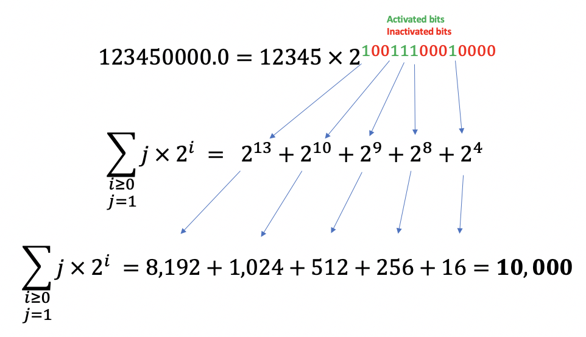
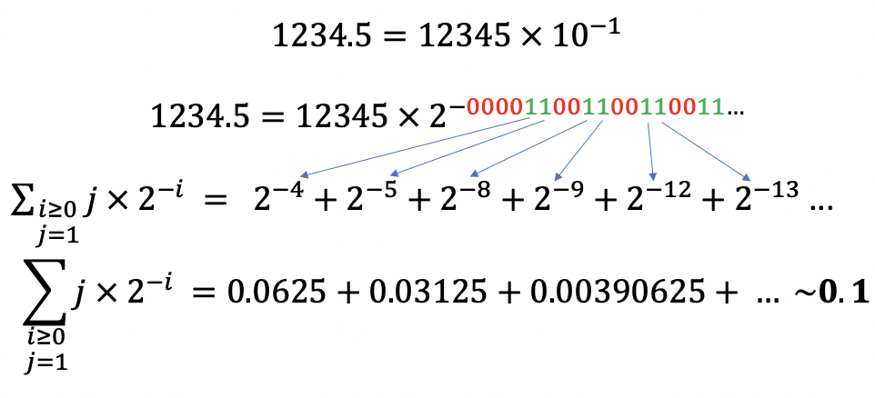
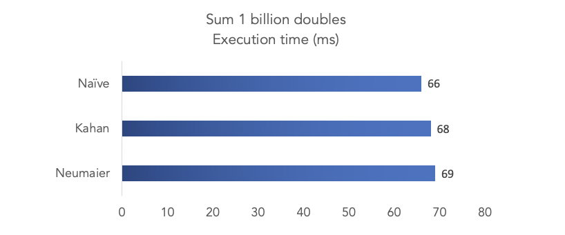
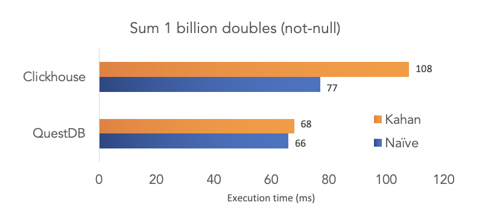

**Summing floating-point values has always implied a tradeoff between speed and accuracy. Until now.**


With its latest [release 4.2.1](https://github.com/questdb/questdb/releases/tag/4.2.1), QuestDB now implements Kahan and Neumaier compensated summation algorithms which perform as fast 
as naive approaches. That's right! More accurate results in the same execution time.

You can find our code in our 
<b> <a href="https://github.com/questdb/questdb" target="_blank"> Github repo. If you like it, please consider leaving a star :-) </a></b>


### TLDR
In this post we cover
- An introductory [example](#more-accurate-additions) of the problem with summing doubles.
- An [overview](#float-representation) of how floating-point numbers are represented.
- A [presentation](#kahans-algorithm-for-compensated-summation) of the Kahan algorithm.
- Our [implementation](#questdbs-implementation-with-avx-instructions) using SIMD instructions.
- Performance [benchmarks](#performance-impact-over-naive-method) amongst summation methods and [across](#comparing-to-other-databases) several databases.

### More accurate additions?
Before we dig in, some of you might wonder how an addition can be inaccurate as opposed to simply right or wrong.

CPUs are poor at dealing with floating-point values. Arithmetics are almost always wrong, with a 
worst-case error proportional to the number of operations `n`. As floating-point operations are intransitive, the order 
in which you perform them also has an impact on accuracy. This is not because QuestDB uses a particular format for doubles. 
In fact, it conforms with the <b> <a href="https://en.wikipedia.org/wiki/IEEE_754" target="_blank">IEEE standard</a></b>.


Here is an example:
```java
    public static void main(String[] args) {
        System.out.println(5.1+9.2);
    }
```

We ask to add `5.1` to `9.2`. The result should be `14.3`, but we get the following instead.
```shell script
14.299999999999999
```

It is a small difference (only `0.000000000000001`), but it is still wrong. To make matters worse, this error can be compounded.

```java
    public static void main(String[] args) {
        double a = 5.1+9.2;
        double b = a + 3.5;
        double c = 14.3 + 3.5;
        System.out.println("The result is: " + b);
        System.out.print("But we expected: " + c);
    }
```

```shell script
The result is: 17.799999999999997
But we expected: 17.8
```

The error has just grown to `0.000000000000003` and will keep on growing as we add operations.


### How is accuracy lost? 

#### Float representation

To understand why, we first need to take a quick look at how floating-point numbers are represented in a computer.
Floats are stored in a format similar to scientific notation like the below. 


However, the number of digits in the significand is fixed, and the base is `2` instead of `10`. In addition, 
the exponent is a series of bits rather than a number. In practice, it looks more like the below.


If we simplify, it is basically the sum of `jx2^i` where `j` is either `0` or `1`.


To calculate a given number, you then multiply the significand by the base elevated to the exponent. As the 
exponent is expressed in bits, it looks like the below. Note that we ignore inactivated bits and that bits reading 
is done from right to left.



#### What about negative exponents?
It gets trickier when using negative exponents (i.e the right-side of the equation inferior to 1). 
In this case, the right side consists of a sum of 
negative powers of two. Here is an example of how this works. Note that in this case the bits in the exponent are read from 
left to right.



Interestingly, this example highlights one of the limits of floating-point representation. The design of the standard made 
a trade-off to **sacrifice precision for range**. In the above example, 
the `0011` pattern will repeat to infinity. Each new bit will get us closer to 0.1. But we will never exactly get there. 
As a result, **it is impossible to properly store `0.1`. Instead, 
computers store something really close, but never exact**. 

#### Truncation accuracy loss
As we saw above, floating-point are not accurately stored. Naturally, operations these numbers will return 
inaccurate results. This is not the only problem. Performing operations is also likely to introduce more errors and to
grow the total error over time. One such case is once the result of an operation has to be truncated to fit the original format. 
Here is a simplified example of the **truncation** that happens when adding floats of different orders of magnitude. 

>For the below example we will be using base 10 and expressing the 
exponent as a number rather than a binary for sake of simplicity. We assume 5 significant digits.

We start with both our numbers expressed in scientific notation.


Let's expand into decimal notation and place them on a similar scale so all digits fit.


Now, let us express this sum back as one number in scientific notation. We have to `truncate` the result back to 5 significant digits. 


The result is incorrect. In fact, it is as if we did not sum anything. 

### Kahan's algorithm for compensated summation
Compensated sum maintains a sum of accumulated errors and uses it to attempt to correct the (inaccurate) sum by the total error amount. 
It does so by trying to adjust each new number by the total accumulated error. 

The main Compensated summation algorithm is the <a href="https://en.wikipedia.org/wiki/Kahan_summation_algorithm" target="_blank">Kahan</a> sum. It runs in 4 steps:

- Subtract the `running error` from the new `number` to get the `adjusted number`. If this is the first number, then the running error is 0.
- Add the `adjusted number` to the `running total` and truncate to the number of significant digits. This is the `truncated result`.
- Calculate the `new running error` as `(truncated result - running total) - adjusted number`
- Assign the `truncated result` as the new `running total`.

Here is how Wikipedia describes the algorithm in pseudocode.

```shell script
function KahanSum(input)
       var sum = 0.0                    // Prepare the accumulator.
       var c = 0.0                      // A running compensation for lost low-order bits.
       for i = 1 to input.length do     // The array input has elements indexed input[1] to input[input.length].
           var y = input[i] - c         // [step 1] c is zero the first time around.
           var t = sum + y              // [step 2] Alas, sum is big, y small, so low-order digits of y are lost.
           c = (t - sum) - y            // [step 3] (t - sum) cancels the high-order part of y; subtracting y recovers negative (low part of y)
           sum = t                      // [step 4] Algebraically, c should always be zero. Beware overly-aggressive optimizing compilers!
       next i                           // Next time around, the lost low part will be added to y in a fresh attempt.
       return sum
```

### Why does this work?
Let's take a closer look at the following:
```shell script
[1] c = (t - sum) - y
[2] t = sum + y
```
Let's replace `t` by `[2]` in our running error `c`
```shell script
c = (t - sum) - y
c = ((sum + y) - sum) - y
Applying addition transitivity to remove brackets, we obtain
c = sum + y - sum - y
c = 0       //???
```

With addition transitivity rules, the error should always be zero.  
Here is a quick example that illustrates how this is not the case. We assume 2 significant digits.

Initial values:
```shell script
a = 0.2
b = 0.4
c = 12
```

Calculate `(a + b) + c`:
```shell script 
= (0.2 + 0.4) + 12
= (0.6) + 12        
= 13                // truncate to 2 significant digits and round up
```

Calculate `(a + c) + b`:
```shell script 
= (0.2 + 12) + 0.4
= 12 + 0.4          // truncate to 2 significant digits 
= 12                // truncate to 2 significant digits 
```

The non-transitivity is the reason why `((sum + y) - sum) - y` returns the error `c` instead of `0`. 

### Applying the algorithm to real numbers
Here is a great example from <a href="https://en.wikipedia.org/wiki/Kahan_summation_algorithm" target="_blank">Wikipedia</a> to illustrate the algorithm's cycle.

```shell script
Assume initial error c is equal to 0
 y = 3.14159 - 0.00000             y = input[i] - c
  t = 10000.0 + 3.14159
    = 10003.14159                   But only six digits are retained.
    = 10003.1                       Many digits have been lost!
  c = (10003.1 - 10000.0) - 3.14159 This must be evaluated as written! 
    = 3.10000 - 3.14159             The assimilated part of y recovered, vs. the original full y.
    = -0.0415900                    Trailing zeros shown because this is six-digit arithmetic.
sum = 10003.1                       Thus, few digits from input(i) met those of sum.
```
The result is too large to be stored with full precision. On the next step, c gives the error.

```shell script
  y = 2.71828 - (-0.0415900)        The shortfall from the previous stage gets included.
    = 2.75987                       It is of a size similar to y: most digits meet.
  t = 10003.1 + 2.75987             But few meet the digits of sum.
    = 10005.85987                   And the result is rounded
    = 10005.9                       To six digits.
  c = (10005.9 - 10003.1) - 2.75987 This extracts whatever went in.
    = 2.80000 - 2.75987             In this case, too much.
    = 0.040130                      But no matter, the excess would be subtracted off next time.
sum = 10005.9                       Exact result is 10005.85987, this is correctly rounded to 6 digits.
```

### QuestDB's implementation with AVX instructions
QuestDB implements the same 4-step algorithm as Kahan. However, it uses vectorised instructions to make this faster.
The idea came from Zach Bjornson who wrote about this on
<b> <a href="http://blog.zachbjornson.com/2019/08/11/fast-float-summation.html" target="_blank"> his blog</a></b>.

Although the implementations are the same, QuestDB's execution time differential between methods is radically different. 
We dig into the details further along the article. Here is the implementation in QuestDB.

We first define our vectors
```java
   Vec8d inputVec;
    const int step = 8;
    const auto *lim = d + count;
    const auto remainder = (int32_t) (count - (count / step) * step);
    const auto *lim_vec = lim - remainder;
    Vec8d sumVec = 0.;
    Vec8d yVec;
    Vec8d cVec = 0.;
    Vec8db bVec;
    Vec8q nancount = 0;
    Vec8d tVec;
```

Then we load vectors with data. What's happening below is exactly Kahan's algorithm. However, instead of summing individual values, 
we are summing vectors of 8 values each.
```java
    for (; d < lim_vec; d += step) {
        _mm_prefetch(d + 63 * step, _MM_HINT_T1);
        inputVec.load(d);
        bVec = is_nan(inputVec);
        nancount = if_add(bVec, nancount, 1);
        yVec = select(bVec, 0, inputVec - cVec);
        tVec = sumVec + yVec;
        cVec = (tVec - sumVec) - yVec;
        sumVec = tVec;
    }
```
You may have noted the `prefetch` instruction above. As QuestDB uses contiguous storage, we can use this instruction 
to ask the CPU to fetch data ahead of time by loading the next page. Doing this means the CPU spends less time waiting for data.
Just this one trick improved our performance by around 20%.

Lastly, we use `horizontal_add` to sum all values into a scalar value. Again, we recognise Kahan's sum algorithm.

```java
    double sum = horizontal_add(sumVec);
    double c = horizontal_add(cVec);
    int nans = horizontal_add(nancount);
    for (; d < lim; d++) {
        double x = *d;
        if (x == x) {
            auto y = x - c;
            auto t = sum + y;
            c = (t - sum) -y;
            sum = t;
        } else {
            nans++;
        }
    }
```

### Performance impact over naive method
The more accurate the result, the better. What is the price of increased accuracy?
 Kahan algorithm adds each new `number` in 4 steps instead of one for the naive approach. 
So in theory it should be 4x slower, right?

**In theory yes. Not with QuestDB.**

As we have shown in a 
[previous article](http://localhost:3000/blog/2020/04/02/using-simd-to-aggregate-billions-of-rows-per-second), QuestDB's sum is actually so fast that it's bound by memory throughput. This means that 
our CPU is actually spending a lot of time waiting for the memory. 

 

What is QuestDB doing while it is idle? Does it lock the CPU? Of course not! It releases it for someone else to use. 
QuestDB's threading model is non-blocking. So whenever a thread is waiting, it does not stay idle and unavailable for other 
work, unlike other time-series databases. It is released to the thread pool, and resumes work as soon as possible.

While we wait for the memory, **we have plenty of CPU time which we can either release or use to improve sum accuracy without affecting performance**. If we use Kahan sum and 
perform 4x as many operations, then as an illustration, our CPU usage time looks like this.


**We fill the gaps with extra work to get a more accurate result without affecting execution time.**
Here are the results when calculating the sum of 1 billion doubles.



**Granted, Kahan and Neumaier sum take slightly longer than the naive approach. However, the impact is 3%, not 400%.
Also, Neumaier's algo, which is a little more precise in certain edge cases but adds more operations to the algorithm performs just as 
fast as Kahan for the same reason.**

### Comparing to other databases
We compared how performance behaves when switching from naive (inaccurate) sum to kahan compensated sum. 

#### Hardware
We run all databases on an `c5.metal` AWS instance, which is a 96-thread machine with 192GB of memory. 
QuestDB was running on 16 threads. As we showed in a [previous article](2020-04-02-using-simd-to-aggregate-billions-of-rows-per-second.md), 
adding more threads does not improve performance beyond a certain point. Clickhouse was running using all cores as per default configuration, 
however we increased the memory limit from the default value of 10GB to 40GB `<max_memory_usage>40000000000</max_memory_usage>`

#### Test data
We generated two test files using QuestDB [random generation functions](/docs/functionsRandomValueGenerators.md) and 
exported the results to csv. We then imported the csv individually in the databases.

```shell script
select rnd_double() from long_sequence(1_000_000_000l); -- non null
select rnd_double(2) from long_sequence(1_000_000_000l); -- with nulls
```

#### Storage engine
- **QuestDB**: on disk
- **Clickhouse**: in memory using the `memory()` engine

> We used the fastest method available for all databases. However, it is worth noting that Clickhouse was 
>in-memory while QuestDB was storing the data on disk.

#### Commands

##### With null
| Description | QuestDB | Clickhouse |
|---|---|---|
|DDL| `create table test_double as(select rnd_double() from long_sequence(1000000000L);`  | `CREATE TABLE test_double (val Nullable(Float64)) Engine=Memory;` |
|Import| not required |`clickhouse-client --query="INSERT INTO test_double FORMAT CSVWithNames;" < test_double.csv `  |
| Naive sum| `select sum(val) from test_double` | `SELECT sum(val) FROM test_double` |
| Kahan sum | `select ksum(val) from test_double` | `SELECT sumKahan(val) FROM test_double`  |

##### Non-null
For non-null values, we adjusted the commands as follows
- use `test_double_not_nul.csv` instead of `test_double.csv`.
- for Clickhouse, skip declaring val as `nullable`: `CREATE TABLE test_double_not_null (val Float64) Engine=Memory;`.
- for QuestDB, replace `rnd_double()` by `rnd_double(2)` at the DDL step.

#### Results
We ran each query several times and took the best result.

Without null values, the three databases are summing naively at roughly the same speed. When using Kahan summation, 
QuestDB performs at the same speed and Clickhouse takes a performance hit of around 40%. 



With null values, Clickhouse takes a performance hit of 28% and 50% for naive and Kahan summation respectively.


We are conscious that this benchmark is not representative of any particular use case. We chose this test because 
it is a basic query, and is trivial to reproduce. With more complex queries, we expect QuestDB's performance gap to compound.
But we still have a few features to implement before we can release more advanced benchmarks, hopefully in the next few weeks. So stay tuned!

### Interested in performance?
If you are interested in what we are doing, want to solve performance issues (or get help to do so), feel free to join
our <b> <a href="https://serieux-saucisson-79115.herokuapp.com/" target="_blank">Slack channel</a></b>. We also push performance-geared 
code on our <b> <a href="https://github.com/questdb/questdb" target="_blank"> Github </a></b> every day. 
Our friendly community of high-performance junkies is growing every day, and we always aim to unpack more performance from QuestDB.